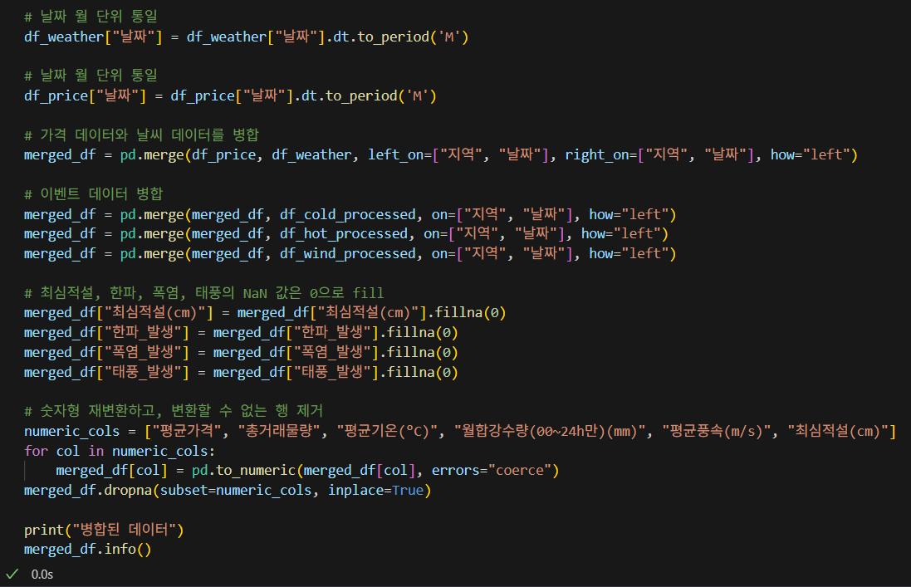

# EDA_MINI_2TEAM

## 💡팀명
#### 2DA
"우리는 데이터를 분석하는 데서 멈추지 않고, 인사이트를 통해 행동으로 옮깁니다."

## ✨팀원 소개

| [최우진](https://github.com/CHUH00) | [조세희](https://github.com/SEHEE-8546) | [정의중](https://github.com/uii42) | [박민정](https://github.com/minjeon) | [맹지수](https://github.com/happyfrogg) |
|-------|-------|-------|-------|-------|
|  |  |  |  |  |

--------

## <프로젝트 개요>
### 📌프로젝트 소개

농축산물 가격 변동의 원인을 탐색하고 시장 역학 관계를 시각적으로 분석하는 EDA 미니 프로젝트 입니다.

소비자 가격의 기간별 추이 및 상호 상관관계를 분석하며, 날씨, 질병 발생, 수출입 현황 등 외부 요인이 가격에 미치는 영향을 파악합니다.

이 프로젝트는 다음을 통해 농축산물 시장의 숨겨진 패턴을 발견하고, 가격 안정화 및 예측에 기여하는 데이터 기반 인사이트를 제공합니다.

### 🪟프로젝트 필요

우리는 매일 먹는 고기나 채소, 과일 등의 가격이 자주 오르내리는 것을 경험합니다. 하지만 그 이유가 무엇 때문인지 소비자나 생산자가 쉽게 알기 어려운 경우가 많습니다.

특히 날씨나 질병, 수입량 변화, 다른 품목의 가격 등 여러 요인들이 서로 얽혀 영향을 주기 때문에 가격 변동의 흐름을 이해하기 어렵습니다.

이 프로젝트는 농축산물 가격에 영향을 주는 다양한 요인을 분석하고, 어떤 요인이 어떤 방식으로 영향을 주는지를 알아보기 위한 것입니다. 이를 통해 가격 변화의 원인을 더 쉽게 이해하고, 향후 변화에 대비할 수 있는 인사이트를 얻는 것이 목표입니다.

-------

## 데이터 선택 및 전처리
### ✅ 데이터 출처
1. [가축 질병 발생현황 데이터](https://data.mafra.go.kr/opendata/data/indexOpenDataDetail.do?data_id=20170913000000000801)
2. [농산물 연도별/월별/일자별 소비자 가격](https://www.kamis.or.kr/customer/reference/openapi_list.do) - API Key 발급
3. [농산물유통정보](https://www.kamis.or.kr/)
4. [축산유통정보](https://www.ekapepia.com/)
5. [기상청 기상자료 개방포털](https://data.kma.go.kr/cmmn/main.do)

### ✅ 데이터 전처리 
1. 로드된 데이터

2. 기후이상 데이터 날짜 컬럼 추가

3. 전처리된 기후이상 데이터

4. 지역, 날짜 기준 데이터 통합, null값 처리

5. 병합된 데이터

6. 이상치 제거

7. 이상치 제거된 데이터

-------

## 📊시각화 자료

### <가축 질병(돼지열병) 발생일자와 축산물 가격>

- ASF(아프리카돼지열병)가 발생하면 대체로 돼지고기의 가격이 하락하는 경향을 보임

### <가축 질병(조류 인플루엔자) 발생일자와 축산물 가격>

- 조류 인플루엔자가 집중적으로 발생하는 구역에는 닭고기의 가격이 상승하는 경향이 있음

### <월별 농산물 가격 변동>

### <월별 가격 변동이 큰 농산물 그래프>

### <시금치 소매가격과 수출 중량 비>

- 시금치 수출은 가격이 내려가면 중량이 늘어난다.

### <월별 기온별 농산물 가격 변동>

### <월별 강수량별 농산물 가격 변동>

### <이상기후 발생시 품목, 지역별 가격 변동>

### <변수간 상관관계 분석>

-------

## 인사이트 도출
 
### 1. 가축 질병과 축산물 가격
- ASF(아프리카돼지열병)가 발생하면 대체로 돼지고기의 가격이 하락하는 경향을 보임
- ASF 발생은 시민들 구매의식 하락 -> 다른 고기로 대체 -> 닭고기와 소고기 가격도 소폭 상승하는 경향
  
- 반면에, 조류 인플루엔자가 집중적으로 발생하는 구역에는 닭고기의 가격이 상승하는 경향이 있음

  => 가축 질병이 발생하면 축산물의 가격에 큰 영향을 끼칠 것으로 사료되었으나, 조류 인플루엔자를 제외하고는 직접적인 영향을 주지 않은 것으로 보임.

### 2. 농산물의 가격변동

- 각 농산물 마다 기온, 강수량, 기상이후에 영향을 미치는 정도가 다르다.
- 지역별로 이상기후가 나타났는지 여부는 전국 평균과 크게 차이가 나지 않는다.
- 깻잎, 상추, 시금치는 고온에 민감 -> 기온이 오르기(여름) 전에 구매 권장
- 오이, 파프리카는 저온에 민감 -> 기온이 떨어지기(겨울) 전에 구매 권장
- 양배추의 가격은 기후적 요인과 관련이 거의없다 -> 사계절 모두 일정된 가격으로 구매 가능 

--------

## 🗨️한줄 회고록

우진 : 공공 API 활용하면서 대규모 품목에 대해 자동화된 데이터 수집 구조를 설계하는 점에서 어려움을 느꼈고, 또한 농수산물 가격 추이와 수출 중량 간의 상관관계를 분석하면서, 어떤 차트를 선택하느냐에 따라 분석 결과의 전달력이 크게 달라진다는 점을 체감했습니다. 또한 데이터 분석은 기획에서 시작된다는 것을 다시 한 번 느꼈습니다. 

민정 : 실제로 데이터를 csv파일로 받아보니 결측치도 많고 엑셀 파일을 받아오다 보니까 날짜에 `가 붙어있는 경우가 있었습니다. 이러한 데이터를 저희가 원하는 그래프를 나타내기 위해 정확하게 전처리를 하는 것이 정말 중요하다는 것을 느꼈습니다. 전처리한 데이터들을 어떤 그래프로 나타내야 원하는 의도가 잘 전달될 수 있는지 고민해볼 수 있는 시간이었습니다. 그리고 프로젝트의 흐름을 위해 지역별로의 가격 변동 추이도 꼭 넣고 싶었으나 지역별로 소비가격이 나와있는 데이터가 없어서 너무 아쉬웠습니다. 

지수 : 다양한 데이터를 수집하고 분석하면서 어떤 시각화 자료가 더 설득력 있고, 전달력 있는지에 대해 고민할 수 있었습니다. 
특히 초기에 데이터 수집과 정제에 많은 시간을 투자했는데, 이러한 과정이 분석 결과의 정확성과 신뢰성에 큰 영향을 미친다는 점을 몸소 느꼈습니다.
시각화 자료를 만드는 과정에서는 팀원들과 협업하며 시각적 표현 방식, 인사이트 도출 방향성에 대해 지속적으로 소통했고, 이를 통해 혼자서는 떠올리기 어려웠던 다양한 관점과 해석을 나눌 수 있었습니다.

의중 : 이번 프로젝트에서 데이터 수집과 날씨 이슈별 데이터 전처리를 담당했다.
Python을 활용해 지역별 기상이슈 여부 등 주요 항목을 정제하며, 팀원이 요구한 형식에 맞추는 데 집중했다.
여러 파일로 나뉜 복잡한 데이터를 통합하고 구조화하는 과정을 통해 데이터 간 연결성과 일관성 확보의 중요성을 깊이 체감할 수 있었다.

세희 : 각 데이터파일을 분석하고 지역, 날짜, 품목,날씨,이상기후 등 여러 컬럼 값의 형태를 통일시키고 이상치 제거, null값 처리등 전처리를 진행하여 의미있는 인사이트를 도출하기 위하여 여러 데이터를 병합하고 그래프 시각화 와 스트림릿을 통한 시각화 작업을 진행하였다. 프로젝트 초기 데이터를 찾고 이를 병합하는데 큰 시간소요가 있었는데 팀원들과 여러 방면으로 소통하며 계속 시도했고 끝에 결국 의미있는 시각화 자료를 많이 찾게 되어 너무 기분 좋은 프로젝트가 되었다. 미니 프로젝트라고 해도 후회가 남지 않도록 최선을 다했다.
